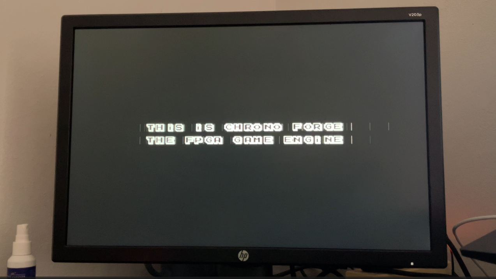
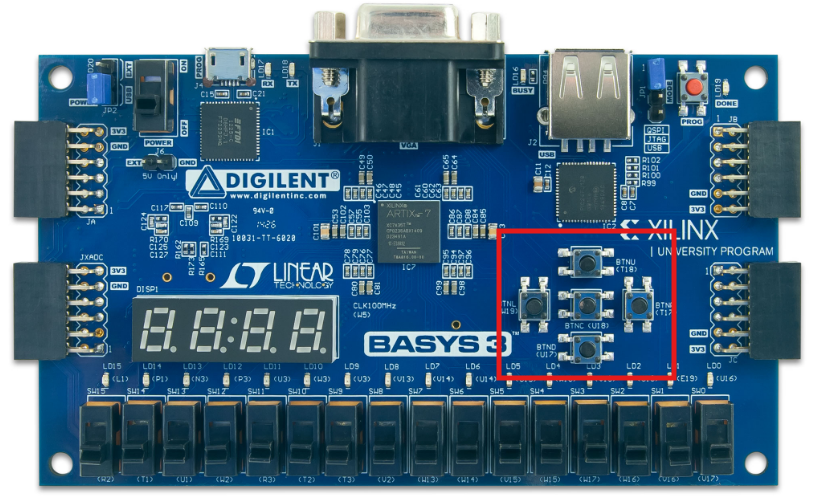
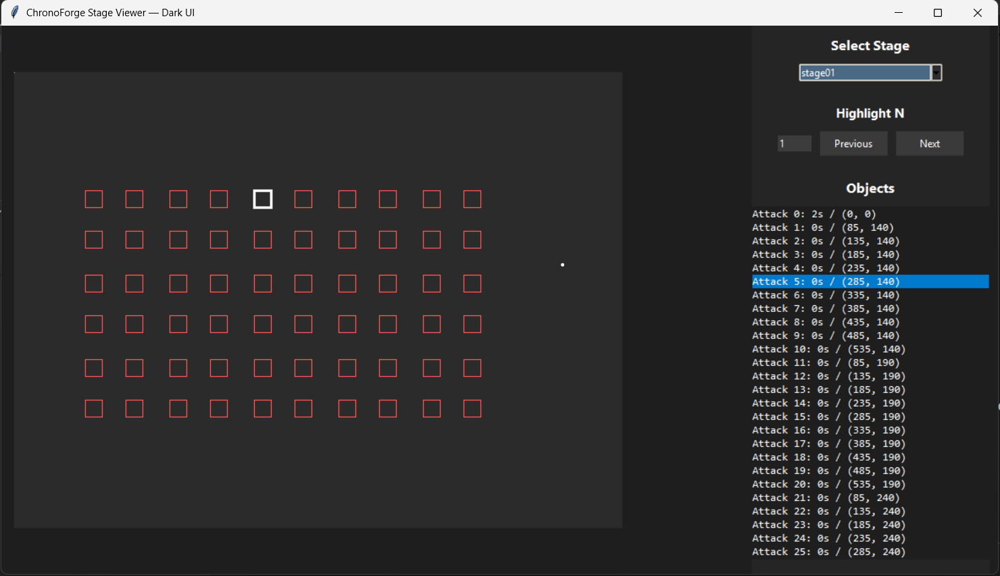

<div align="center">

# ChronoForge ⚡

**A 2D game engine that runs as _pure hardware_ — no CPU, no OS, no instruction set.**

You author your game in Python; it executes directly as event-driven Verilog
circuits on an FPGA, at 640×480 @ 60 Hz.


[](LICENSE)

<br>

<a href="https://youtu.be/yzlUlyLRUwM">
  
</a>

**▶ [Watch the system demo on YouTube](https://youtu.be/yzlUlyLRUwM)**

</div>

---

## Highlights

- **Direct-logic engine — no CPU, no ISA, no OS, no emulator.** Every game event
  is a hardware state transition, so there is zero fetch/decode overhead. Logic
  reacts directly to data stored as hex blocks in ROM.
- **Parallel by construction.** Every object — attack, platform, character —
  is its own hardware instance, so they all compute at once. Frame cost stays
  flat at 640×480 @ 60 Hz no matter how crowded the screen gets.
- **Fully deterministic.** No OS, no interrupts: the same ROM and the same inputs
  produce the exact same frame, every time. What the compiler emits is exactly
  what the silicon runs.
- **Python authoring, zero Verilog.** You write a stage as a handful of Python
  classes; our compiler folds and bit-packs them into the hex ROMs the board
  reads directly. Loops and list comprehensions give you bullet-hell patterns for
  free.
- **Tuned to the metal.** At its peak the engine composes its full default object
  pool inside the ~4-clock VGA pixel budget in **≈18k LUTs / 7k FFs** on a low-end
  Basys3.

> ChronoForge started as a single counter circuit mapping indices into a ROM of
> event commands, and grew — through a lot of trial and error — into a full game
> runtime. We designed and built every layer ourselves: the circuits, the binary
> format, the compiler, and the authoring language. It was our personal playground
> for proving that a game engine can live entirely in hardware.

---

## How it works

ChronoForge is a **decentralized, multi-clock, event-driven** design. Instead of a
CPU running a game loop, each *runtime* owns one responsibility and its own clock
domain, and they coordinate over a tiny two-wire handshake.

Game logic never runs as code on the board. It is pre-processed on a PC, down a
**"meaning stack"** where each layer removes ambiguity, until it becomes a flat
hex ROM the hardware indexes into:

```
stage/*.py  ──►  JSON source  ──►  JSON decode  ──►  mem/*.mem  ──►  FPGA
(Python class)   (per stage)       (per object)      (hex ROM)      (BRAM)
```

### The hardware timeline scheduler

All gameplay is driven by three independent **timelines** — **Attack**,
**Platform**, and **Character** — each just a ROM index counter that walks its
object list and advances when the current object's `wait_time` elapses. No CPU, no
script engine, just counters reading rows.

```
Attack:    start ──► A0 ──► A1 ───────────► A2 ─► end ─► reset
Platform:  start ─► P0 ───────────► P1 ──► P2 ─► end
Character: start ─► C1 ─► C2 ──────────────► C3 ─► end
```

The **Attack timeline is the global epoch**: when it reaches its terminal header
(`0xFFF…`) the whole game resets. An empty "null" object (`w = h = 0`) draws
nothing but still burns its `wait_time`, so it doubles as a pure time delay —
that's how pauses, waves, and pacing are scripted directly in ROM.

> Full scheduler mechanism, every module, and how the cores communicate:
> **[docs/hardware-architecture.md](docs/hardware-architecture.md)**.

### What you can build

| Surface           | What you control                                                                 |
| ----------------- | -------------------------------------------------------------------------------- |
| **Objects**       | free position, custom size, 32 speed levels, 8 movement directions, wait/destroy timing |
| **Player**        | display position & size, custom hitbox, gravity on/off, HP & damage sensitivity, HP bar |
| **Stages**        | per-stage play area, gravity, pacing, and a live on-screen `HP ###/###` readout  |
| **Input**         | four on-board push buttons (up / down / left / right) + a reset switch            |

---

## Authoring a level — a taste

A whole stage is just a Python function returning a `GameStage`. Because objects
live in plain lists, loops give you bullet-hell patterns for free — here's a
falling wave of ten blocks that fans out as `speed` ramps across the row:

```python
def stage():
    s = GameStage()
    s.game_manager = GameManager(stage=1, wait_time=1, gravity_direction=0,
                                 display_pos_x1=0, display_pos_y1=0,
                                 display_pos_x2=0, display_pos_y2=0)

    # 10 blocks marching down (dir 4), each a touch faster than the last
    s.attack_objects.extend([
        AttackObject(movement_direction=4, speed=4 + i,
                     pos_x=85 + 50 * i, pos_y=140, w=20, h=20,
                     wait_time=0, destroy_time=4, destroy_trigger=2)
        for i in range(10)])

    s.platform_objects.append(            # ≥1 placeholder required
        PlatformObject(movement_direction=2, speed=0, pos_x=0, pos_y=0, w=0, h=0,
                       wait_time=0, destroy_time=0, destroy_trigger=2))
    return s
```

UI screens are the same idea — place text as glyphs, or let the hardware draw the
live HP readout for you:

```python
def stage():
    s = GameUIStage()
    s.game_ui = GameUI(show_healt_text=1, healt_current=100, healt_max=100,
                       healt_bar_pos_x=140, healt_bar_pos_y=60,
                       healt_bar_w=200, healt_bar_h=16,
                       healt_bar_sensitivity=0.04, wait_time=30)
    return s   # show_healt_text=1 auto-draws "HP 100/100" — no glyphs needed
```

> Full class API, procedural patterns, and longer showcases live in
> **[docs/python-guide.md](docs/python-guide.md)**.

---

## By the numbers

**Board utilization (Basys3, shipped configuration):**

| Resource | Used  | Available | Usage |
| :------- | :---- | :-------- | :---- |
| LUT      | 18015 | 20800     | 87%   |
| FF       | 7196  | 41600     | 17%   |
| BUFG     | 6     | 32        | 19%   |

*Defaults: 56 dynamic attack objects, 25 dynamic platform objects, 79 character
slots — set in `topModule.v`. LUT is the binding constraint.*

**ROM capacity (Basys3 BRAM ≈ 1.8 Mb / 225 KB):**

| ROM type         | Bytes / object | Max count (BRAM) |
| :--------------- | :------------- | :--------------- |
| Attack object    | 9 bytes        | 25,000           |
| Platform object  | 8 bytes        | 28,125           |
| Character object  | 3 bytes        | 75,000           |

**Clock domains** (all derived from the 100 MHz input):

| Clock                | Frequency | Drives                          |
| -------------------- | --------- | ------------------------------- |
| `clk_vga`            | 25 MHz    | VGA 640×480 timing              |
| `clk_calculation`    | 1 kHz     | sync, collision, ROM updates    |
| `clk_player_control` | 100 Hz    | player input / physics          |
| `clk_object_control` | 100 Hz    | object movement                 |
| `clk_centi_second`   | 100 Hz    | `wait_time` / `destroy_time`    |

---

## Engineering challenges

The honest part — the problems that shaped the design.

1. **The 4-clock pixel deadline.**
   The core runs at 100 MHz but the VGA clock is 25 MHz, leaving only **~4 cycles
   per pixel**. With a workload of 100 triggers, 50 colliders, and 100 characters,
   deep multiplexer trees and `if-else` chains are far too slow. We considered
   spatial partitioning, but it was too complex to link with the event-driven
   runtime. The fix was deliberately brutal: **bitwise-OR composition** merges every
   object's pixel signal instantly, and a single fixed-priority mux picks the color.

2. **Event-driven runtime synchronization.**
   The plan was to split runtimes by responsibility and bridge them over a single
   calculation clock — simple in theory, brutal in practice, because every runtime
   had its own "self-thought" and the communication timelines went non-linear. We
   reduced redundancy by pulling all decision-making into **three mother runtimes**
   and stripping the rest down to "no-thought" executors that only react.

3. **Instance-spawning lag (the "millisecond lie").**
   On real hardware, a 100 Hz behavior tick (0.01 s) wasn't fast enough: our
   handshake needs three clock checks, so a spawn could lag ~0.03 s — visible to
   players. The fix was to run the **synchronization/calculation domain
   (`clk_calculation`) at 1 kHz**, so every handshake settles ten times faster while
   the cheap 100 Hz behavior clocks stay put. The name `clk_centi_second` stuck
   around from the original design even though the timing-critical path is now
   millisecond-resolution — hence the "lie." (Exact divisors live in
   [docs/hardware-guide.md §6](docs/hardware-guide.md#6-clock-domains).)

4. **Bridging human code and hex.**
   With no prior experience in this field, we had to connect human-readable game
   logic to post-processed hex data. The answer was the **meaning stack** —
   `Python class → JSON source → JSON decode → MEM → FPGA` — where each layer adds
   intent while removing ambiguity, so authors never touch hardware.

5. **A tangle too large to visualize.**
   The project grew feature-by-feature through trial and error, which left
   inconsistent naming and coding styles across modules. We refactor often, but
   parts are still messy — and this README documents that reality rather than
   hiding it. The focused guides below are the cleaned-up, code-verified truth.

---

## Quick start

**Author & compile a game (Python side):**

```bash
# 1. Python stage classes -> per-stage JSON (also auto-counts objects)
python tools/main/compile_stage_to_json.py

# 2. (optional) preview object layout & timing in a GUI
python tools/main/open_game_engine_gui.py

# 3. compile JSON -> the .mem ROMs in /mem (fold + bit-pack)
python tools/main/compile_stage_to_mem.py
```

Step 3 writes the five compiled ROMs; together with the separately-generated font
ROM, that's the six `.mem` files the hardware loads.

**Build & flash (hardware side):**

1. Open `vivado/ChronoForge.xpr` in Vivado.
2. **Generate Bitstream**, then **Program Device** (Basys3 over USB).
3. Connect VGA to a monitor — the game runs immediately. The four on-board push
   buttons move the player; slide switch **SW0** is reset.

<div align="center">
  
</div>

Porting to a non-Basys3 board only needs the pin file
(`verilog/constrains/constains.xdc`) — see
[docs/hardware-guide.md](docs/hardware-guide.md).

> New here? Start with **[docs/python-guide.md](docs/python-guide.md)** to make a
> level, then **[docs/hardware-guide.md](docs/hardware-guide.md)** to put it on the
> board.

<div align="center">
  
</div>

---

## Documentation

| Guide | What's inside |
| ----- | ------------- |
| **[docs/python-guide.md](docs/python-guide.md)** | Authoring games in Python: the class API, writing stages/UI, procedural patterns, compiler internals, and font tooling. |
| **[docs/hardware-guide.md](docs/hardware-guide.md)** | Using the hardware: Vivado build flow, board/pin config, clock & resource knobs, and how the `.mem` ROMs wire into the project. |
| **[docs/hardware-architecture.md](docs/hardware-architecture.md)** | How the engine works inside: every module, the three timelines, and how the runtime cores communicate. |

*(For contributors and AI agents, `CLAUDE.md` is a one-page map of the whole repo.)*

---

## Project structure

```bash
ChronoForge-FPGA-Engine/
├── README.md            ← This file (project overview)
├── CLAUDE.md            ← Repo map for contributors / AI agents
├── docs/                ← Focused guides + image assets
│   ├── python-guide.md          ← Authoring + compiler
│   ├── hardware-guide.md        ← Vivado build & config
│   ├── hardware-architecture.md ← How the hardware works
│   └── images/
├── mem/                 ← Final compiled .mem ROM images loaded by the FPGA
├── systhesis/           ← Font tooling + 17×17 glyph images
├── tools/               ← Python toolchain
│   ├── main/            ← Game authoring workspace (you write here)
│   │   ├── stage/       ← Attack + platform objects per stage
│   │   ├── stage_ui/    ← UI config + on-screen character (text) objects
│   │   ├── compile_stage_to_json.py
│   │   ├── compile_stage_to_mem.py
│   │   └── open_game_engine_gui.py
│   ├── interpret_langauge/ ← Authoring class API (game_class.py)
│   ├── compiler/        ← Folding + bit-packing compiler
│   └── python_gui/      ← tkinter stage previewer
├── verilog/             ← All hardware source code
│   ├── constrains/      ← Pin mapping (constains.xdc)
│   ├── simulation/      ← Testbenches
│   └── sources/         ← RTL modules (top/, runtime/, rom_reader/, object/, …)
└── vivado/              ← Vivado project (ChronoForge.xpr)
```

---

## Credits

Designed and built end-to-end — circuits, binary format, compiler, and authoring
language — by **Night**, as a personal exploration of hardware-native game
runtimes.

**Target platform:** Xilinx Basys3 (Artix-7) · **Architecture:** V4 · **Display:**
640×480 @ 60 Hz.

---

## License

ChronoForge is released under the [MIT License](LICENSE) — free to use, modify,
and build on. If you make something cool with it, a link back to
[the repository](https://github.com/Jakkarin-Promsee/chronoforge-fpga-engine) is
always appreciated.
